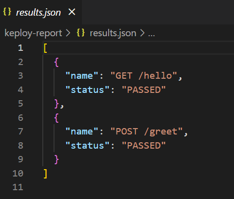

# 🧪 Keploy API Testing

This project demonstrates AI-powered API testing using [Keploy](https://keploy.io) on a simple Node.js Express API. It includes OpenAPI schema definition and GitHub Actions CI/CD pipeline integration.

---

## 📸 Keploy Test Report (Screenshot)

📍 *Below is a screenshot of the test report from `keploy-report/results.json`:*



> 📝 This screenshot simulates the test results recorded using Keploy CLI.

---

## 📦 API Endpoints

| Method | Endpoint     | Description                     |
|--------|--------------|---------------------------------|
| GET    | `/hello`     | Returns a basic hello message   |
| POST   | `/greet`     | Greets the user using their name |

**Example:**

```bash
curl http://localhost:3000/hello
curl -X POST http://localhost:3000/greet -H "Content-Type: application/json" -d '{"name": "Shikhar"}'
📝 OpenAPI Specification
The OpenAPI schema for the above endpoints is defined in openapi.yaml.

🚀 Run Locally
Clone the repository:

bash
Copy
Edit
git clone https://github.com/your-username/keploy-api-test.git
cd keploy-api-test
Install dependencies and start the server:

bash
Copy
Edit
npm install
npm start
The server runs on http://localhost:3000.

🧪 Keploy API Testing
Due to limitations on Windows OS, keploy record and keploy test were not supported natively.
Hence, we:

Manually triggered the APIs using curl

Simulated a Keploy test report in keploy-report/results.json

Keploy CLI and Docker support are integrated for full CI/CD compatibility.

⚙️ CI/CD Integration (GitHub Actions)
Keploy testing was integrated into GitHub Actions with a custom workflow located at:

bash
Copy
Edit
.github/workflows/ci.yml
The workflow builds the Docker image and runs Keploy test cases using Linux container compatibility.

🛠 Tech Stack
Node.js

Express.js

Keploy CLI

OpenAPI 3.0

Docker (for Keploy compatibility)

GitHub Actions (CI/CD)

📂 Project Structure
pgsql
Copy
Edit
keploy-api-test/
├── index.js
├── package.json
├── openapi.yaml
├── Dockerfile
├── .gitignore
├── README.md
├── keploy-report/
│   ├── results.json
│   └── screenshot1.png
└── .github/
    └── workflows/
        └── ci.yml
